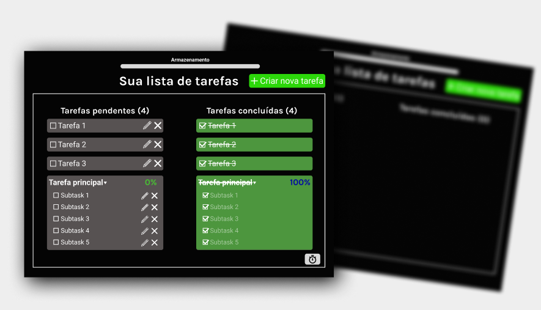
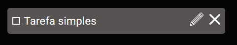
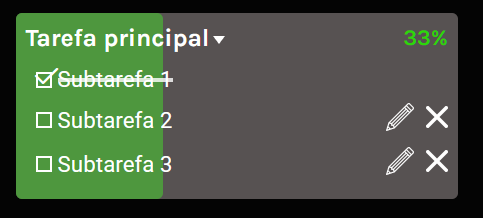

# Advanced To-Do List
Lista de tarefas avançada com suporte a subtarefas, drag and drop, UX, armazenamento local e muito mais.

## Sobre o projeto
Criado originalmente para atender minhas necessidades do dia a dia e para estudo, o **Advanced To-Do List** é um sistema de gerenciamento de tarefas que vai além das listas de tarefas tradicionais, oferecendo diversas funcionalidades e preservando a imersão do usuário.

## Funcionalidades principais
* ✅ Criação de tarefas simples e principais;
* 🔁 Subtarefas com progresso automático;
* 💾 Armazenamento local (sem perda de dados ao recarregar);
* 🌙 Tema imersivo com animações visuais;
* 📄 Documentação (ver seção [Documentação](#-documentação));

## Exemplos:
| Tarefa Simples | Tarefa Principal |
|----------------|-----------------|
|  |  |

## Design e Usabilidade
O design foi completamente criado a partir do Figma antes da codificação.
Foram definidos grids, cores, ícones e tipografia para manter consistência visual.

🔗 [Acesse o Design no Figma](https://bit.ly/advanced-todo-list)

## Documentação
A documentação completa do projeto está disponível em PDF dentro da pasta `docs/Documentacao.pdf`
[Baixar Documentação (PDF)](./docs/Documentacao.pdf)

## Próximos Passos
- Estudo de Banco de Dados (PostgreSQL)
- Aprofundamento em Acessibilidade, Responsividade e Performance Web
- Publicação de novos projetos com foco em usabilidade

## To Do 

**Status** : Em desenvolvimento
 * [x] Criar estrutura inicial do projeto
 * [x] Configurar repositório e README
 * [x] Finalizar layout (HTML + CSS)
 * [x] Desenvolver sistema de tarefas simples
 * [x] Desenvolver sistema de subtarefas
 * [x] Salvar tarefas simples em Storage
 * [x] Salvar tarefas principais em Storage
 * [x] Editar e deletar tarefa simples de DOM e Storage
 * [x] Editar e deletar tarefa principal de DOM e Storage
 * [x] Editar e deletar subtarefas de DOM e Storage
 * [x] Sistema de transformar tarefa principal em tarefa simples
 * [x] Salvar tarefas e subtarefas concluídas em Storage
 * [x] Enviar tarefas simples concluídas para coluna de "Tarefas Concluídas"
 * [x] Enviar tarefas principais concluídas par coluna de "Tarefas Concluídas"
 * [x] Atualizar contador de tarefas pendentes e tarefas concluídas
 * [x] Adicionar sistema de Drag and Drop
 * [x] Salvar posicionamento de subtarefas em modal
 * [x] Adicionar Modal de Continuação de Criação
 * [x] Criar aviso para recarregar página após excluir uma subtarefa
 * [x] Adicionar Confirmação de Conclusão em drag and drop
 * [x] Integrar animação visual do modal na criação de tarefas
 * [x] Sistema de ativar/desativar reset diário
 * [x] Adicionar responsividade
 * [x] Sistema de tarefas pré-definidas
 * [x] Sistema de armazenamento de localStorage
 * [x] Documentação
 * [ ] Reformular README
 * [ ] Associar Wireframe do Figma no README
